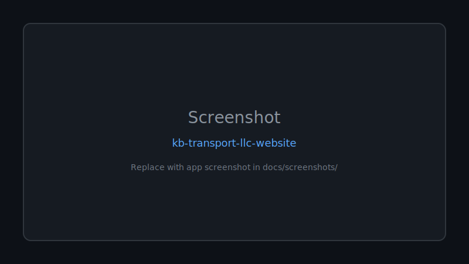

# 🚀 Kb Transport Llc Website

**Official website for KB Transport LLC — a professional trucking and dispatch company providing nationwide logistics solutions across the United States.**

Documented · MIT licensed · Maintained

[Features](#-features) · [Quick Start](#-quick-start) · [Screenshots](#-screenshots) · [Contributing](CONTRIBUTING.md)

---

## 🖼 Screenshots

*Replace `docs/screenshots/placeholder.svg` with real app screenshots.*

---

## 🐍 Contribution graph

<picture>
  <source media="(prefers-color-scheme: dark)" srcset="https://raw.githubusercontent.com/mafzalkalwardev/kb-transport-llc-website/output/snake-dark.svg" />
  <source media="(prefers-color-scheme: light)" srcset="https://raw.githubusercontent.com/mafzalkalwardev/kb-transport-llc-website/output/snake.svg" />
  
</picture>

---

Professional dispatch and logistics marketing website for KB Transport LLC.

## What’s included
- Single-page website (`index.html`) with responsive layout
- Sections: Hero, About, Services, Equipment, Why Choose Us, Process, Stats, Testimonials, Equipment Gallery, FAQ, Contact, Footer
- Client-side behavior for:
  - Scroll reveal animations
  - Counter animations
  - FAQ expand/collapse
  - Contact form “submit” simulation (no backend)

## Local preview
1. Open `index.html` in your browser.

## Deployment (GitHub)
This repository is suitable for **GitHub Pages** because it’s a static site.
- GitHub Pages works best when your `index.html` is served from the repo root.

## Repository structure
- `index.html` — the website
- `README.md` — this documentation
- `.gitignore` — git ignore rules

## Notes / limitations
- The contact form simulates submission in the browser and does not send data to a server.

